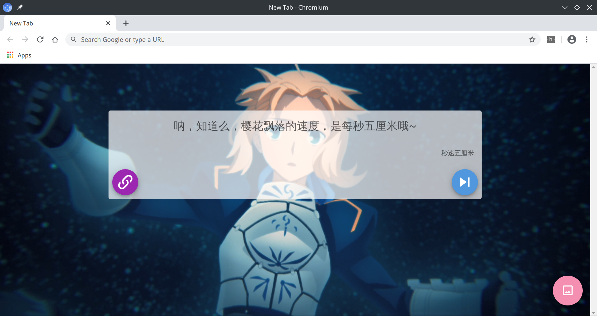
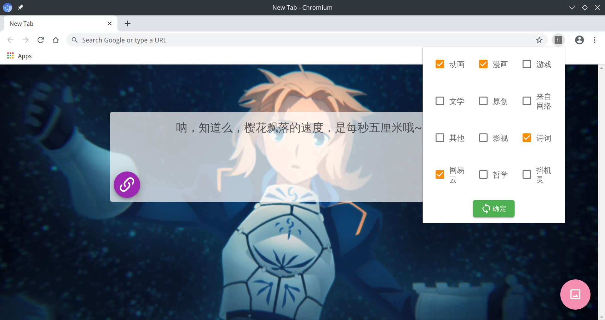
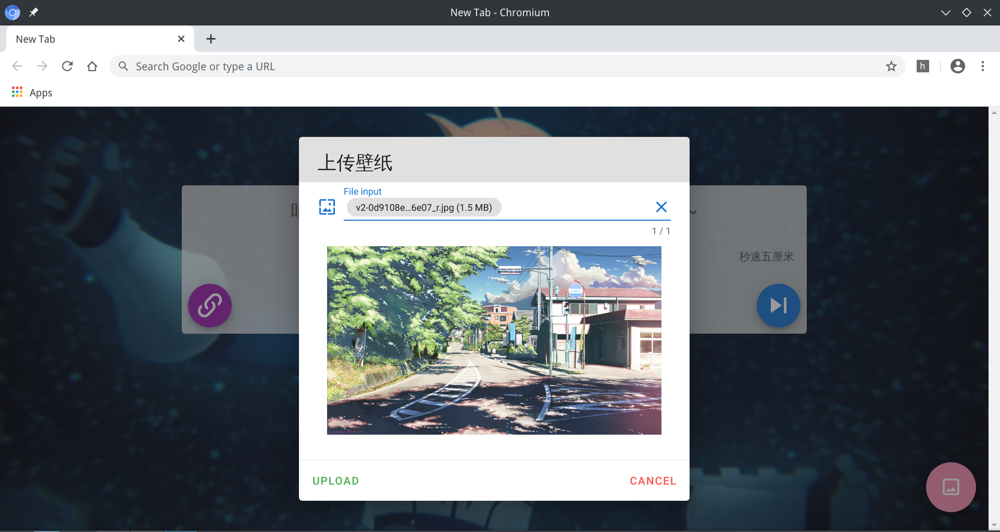

# hitokoto-newtab
A web extension changing default new tab to hitokoto

___

一个将浏览器新标签页改为[一言](https://hitokoto.cn/)的小插件，用`Vue.js`编写

## Usage/使用方法

**已在chrome web store发布，可直接点击[链接](https://chrome.google.com/webstore/detail/hitokoto-newtab/idbfacpljhlamgmclfbpcaiiobcggpdm)下载**

```bash
npm install
```

```bash
npm run build
```

First enable Developer mode in `chrome://extensions/`, choose `Load uppacked`, and upload `dist` directory.

在`chrome://extensions/`里启用“开发者模式”，然后选择“加载已解压的扩展程序”、上传`dist`目录即可。

## Screenshot/项目截图

### 新标签页



---

### 类别选择



---

### 上传壁纸



## Todo

+ [x] 添加选择一言类别的功能（2020/05/13）
+ [x] 新标签页同步更新选择（2020/05/15）
+ [x] 添加上传壁纸的功能（2020/05/14）
+ [ ] 缩减插件大小
+ [ ] 美化界面
+ [ ] 解决壁纸大小问题

## Thanks/感谢

[Kocal](https://github.com/Kocal)/**[vue-web-extension](https://github.com/Kocal/vue-web-extension)**

[hitokoto-osc](https://github.com/hitokoto-osc)/**[Hitokoto-v1](https://github.com/hitokoto-osc/Hitokoto-v1)**
