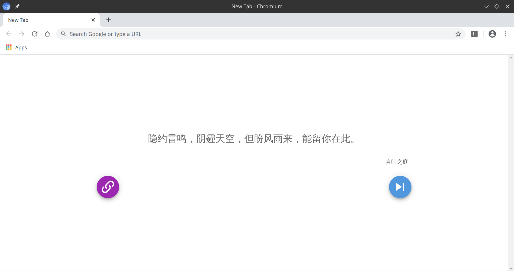
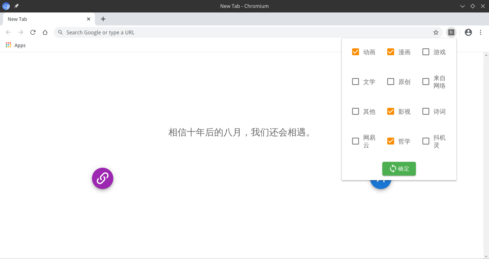

# hitokoto-newtab
A web extension changing default new tab to hitokoto

___

一个将浏览器新标签页改为一言的小插件，用`Vue.js`编写

## Usage/使用方法

```bash
npm install
```

```bash
npm run build
```

First enable Developer mode in `chrome://extensions/`, choose `Load uppacked`, and upload `dist` directory.

在`chrome://extensions/`里启用“开发者模式”，然后选择“加载已解压的扩展程序”、上传`dist`目录即可。

## Screenshot/项目截图





## Todo

+ [x] 添加选择一言类别的功能
+ [ ] 添加上传壁纸的功能
+ [ ] 缩减插件大小

## Thanks/感谢

[Kocal](https://github.com/Kocal)/**[vue-web-extension](https://github.com/Kocal/vue-web-extension)**
